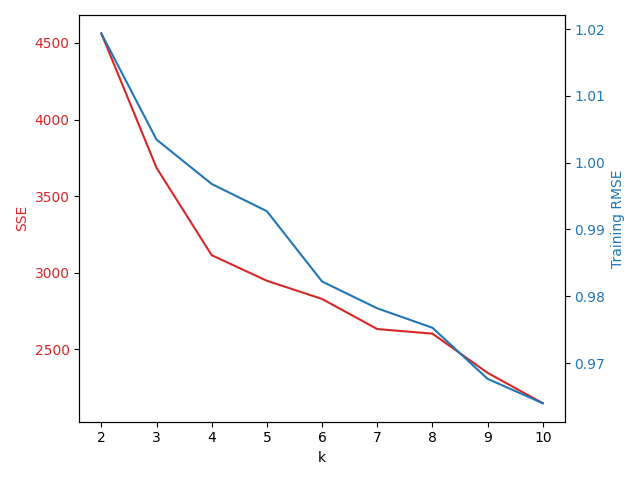
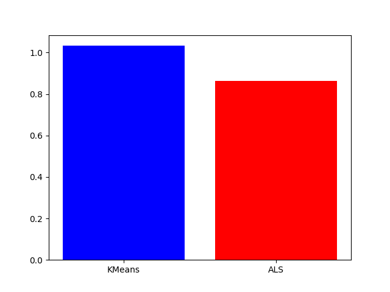

### 
COP_6526 Assignment 2
 ##### 
 Mina Sonbol 
 #### (1) How to run the applications To run the code for this assignment use the following command: `spark-submit MovieLensRecommender.py <directory>` For the *\<directory>* parameter, please provide the full path of the directory containing the files movies.dat & *ratings.dat*. If you are running this script from the same directory containing these files, then use a ./ instead. The following example shows the command used when the files are located in a directory called */home/medium/*: `spark-submit MovieLensRecommender.py /home/medium/` **PS: The code takes about 2 hours to finish.** A few points about the submitted files: 1. I have included the code for both algorithms in the same file for the following reasons: 1. Ease of use 2. To ensure that both algorithms are being tested on the same test split data. 2. After running the script, a report showing the results of both algorithms will be generated and printed on screen, starting with the KMeans resutls and followed by the ALS results. A copy of that log in included with my submission, look for a file called out_with_memroy_2g_param.log (this is a very large text file, so it might be best to open it in a terminal window, or just use the command `tail -100 out_with_memroy_2g_param.log` to print the last 100 lines). #### (2) How you tune the accuracy of each approach I use the same 70-30 data split on the ratings data set for both models. The data set contains 1 million ratings made by 6040 users on 3706 movies. After the split, the ratings are split into aproximately 700k for training and 300k for testing. Advanced_Analytics_and_Machine_Learning-Chapter_28_Recommendation.py assignment_02_report.md assignment2_scratch.py clean.py input.csv iris.csv kmeans_1-100.png kmeans_2.py kmeans.png kmeans.py kmeans_training_results.csv kmeans_tutorial.py medium MovieLensRecommender.py movies.dat movies_samples.csv movies_samples.dat nohup.out outlier_kmeans.py out_with_memroy_2g_param_10262020.log out_with_memroy_2g_param.log part1_kmeans.py part1.py part2_als.py Pipfile prediction_ratings.csv predictions_df_iris.csv rating_prediction_userid_2_all.csv rating_prediction_userid_2.csv ratings_cluster_join.csv ratings.csv ratings.dat ratings_ordered.csv ratings_predictions.csv ratings_same_columns.csv ratings_same_columns.srt ratings_sample_prediction.csv ratings.srt sacred.py scratch_1.py split_issues.py sseDF_10242020_1301.csv test_rmse.png user1159 user_2.csv userRatingMatrix.csv **KMeans Parameter Tuning** First, I would like to make a note about the movies data set. I used the entire movies data set while training the k-means model, because, in a hypothetical scenario where this model is to be applied by a movie streaming company, I assume that the company will have the entire movie data set beforehand, and there will no be major changes to this data set later on; therefore, based on this assumption, I concluded that there will be no need to do a split on the movies data set. Second, to calculate the users' average cluster rating, I use the ratings training data only, because I assume that these are the ratings that we have beforehand, and that the user has still not seen the movies in the test data set. Finally, to find the best k, I trained the k-means model using 9 different k valeus, ranging from 2 to 10. For each k, I calculated the model's SSE. Also, I calculated the model's training RMSE using the ratings training data set. To choose the best model, I picked the k corresponding to the largest drop in SSE. Note that, as k increases, the training RMSE decreases. This does not imply that the model with the lowest training RMSE is the best model, quiet the opposite, it is highly probable that such model might be overfitting the data. 
  
 
 |k|SSE|SSE Differential|Training RMSE| | :--: | :--: | :--: | :--: | |2|4561.205904|0.000000|1.019341| |**3**|**3684.903938**|**-876.301967**|**1.003455**| |4|3114.751107|-570.152830|0.996809| |5|2947.874865|-166.876242|0.992731| |6|2829.261595|-118.613270|0.982208| |7|2632.921201|-196.340394|0.978191| |8|2602.976426|-29.944776|0.975281| |9|2347.202791|-255.773635|0.967629| |10|2148.972410|-198.230381|0.963978| 
 Advanced_Analytics_and_Machine_Learning-Chapter_28_Recommendation.py assignment_02_report.md assignment2_scratch.py clean.py input.csv iris.csv kmeans_1-100.png kmeans_2.py kmeans.png kmeans.py kmeans_training_results.csv kmeans_tutorial.py medium MovieLensRecommender.py movies.dat movies_samples.csv movies_samples.dat nohup.out outlier_kmeans.py out_with_memroy_2g_param_10262020.log out_with_memroy_2g_param.log part1_kmeans.py part1.py part2_als.py Pipfile prediction_ratings.csv predictions_df_iris.csv rating_prediction_userid_2_all.csv rating_prediction_userid_2.csv ratings_cluster_join.csv ratings.csv ratings.dat ratings_ordered.csv ratings_predictions.csv ratings_same_columns.csv ratings_same_columns.srt ratings_sample_prediction.csv ratings.srt sacred.py scratch_1.py split_issues.py sseDF_10242020_1301.csv test_rmse.png user1159 user_2.csv userRatingMatrix.csv **ALS Parameter Tuning** For ALS, I built a parameter grid with the following parameter value ranges: Advanced_Analytics_and_Machine_Learning-Chapter_28_Recommendation.py assignment_02_report.md assignment2_scratch.py clean.py input.csv iris.csv kmeans_1-100.png kmeans_2.py kmeans.png kmeans.py kmeans_training_results.csv kmeans_tutorial.py medium MovieLensRecommender.py movies.dat movies_samples.csv movies_samples.dat nohup.out outlier_kmeans.py out_with_memroy_2g_param_10262020.log out_with_memroy_2g_param.log part1_kmeans.py part1.py part2_als.py Pipfile prediction_ratings.csv predictions_df_iris.csv rating_prediction_userid_2_all.csv rating_prediction_userid_2.csv ratings_cluster_join.csv ratings.csv ratings.dat ratings_ordered.csv ratings_predictions.csv ratings_same_columns.csv ratings_same_columns.srt ratings_sample_prediction.csv ratings.srt sacred.py scratch_1.py split_issues.py sseDF_10242020_1301.csv test_rmse.png user1159 user_2.csv userRatingMatrix.csv ranks: 1, 10, and 100 Advanced_Analytics_and_Machine_Learning-Chapter_28_Recommendation.py assignment_02_report.md assignment2_scratch.py clean.py input.csv iris.csv kmeans_1-100.png kmeans_2.py kmeans.png kmeans.py kmeans_training_results.csv kmeans_tutorial.py medium MovieLensRecommender.py movies.dat movies_samples.csv movies_samples.dat nohup.out outlier_kmeans.py out_with_memroy_2g_param_10262020.log out_with_memroy_2g_param.log part1_kmeans.py part1.py part2_als.py Pipfile prediction_ratings.csv predictions_df_iris.csv rating_prediction_userid_2_all.csv rating_prediction_userid_2.csv ratings_cluster_join.csv ratings.csv ratings.dat ratings_ordered.csv ratings_predictions.csv ratings_same_columns.csv ratings_same_columns.srt ratings_sample_prediction.csv ratings.srt sacred.py scratch_1.py split_issues.py sseDF_10242020_1301.csv test_rmse.png user1159 user_2.csv userRatingMatrix.csv maxIters: 5, 10, and 15 Advanced_Analytics_and_Machine_Learning-Chapter_28_Recommendation.py assignment_02_report.md assignment2_scratch.py clean.py input.csv iris.csv kmeans_1-100.png kmeans_2.py kmeans.png kmeans.py kmeans_training_results.csv kmeans_tutorial.py medium MovieLensRecommender.py movies.dat movies_samples.csv movies_samples.dat nohup.out outlier_kmeans.py out_with_memroy_2g_param_10262020.log out_with_memroy_2g_param.log part1_kmeans.py part1.py part2_als.py Pipfile prediction_ratings.csv predictions_df_iris.csv rating_prediction_userid_2_all.csv rating_prediction_userid_2.csv ratings_cluster_join.csv ratings.csv ratings.dat ratings_ordered.csv ratings_predictions.csv ratings_same_columns.csv ratings_same_columns.srt ratings_sample_prediction.csv ratings.srt sacred.py scratch_1.py split_issues.py sseDF_10242020_1301.csv test_rmse.png user1159 user_2.csv userRatingMatrix.csv lambdas: 0.001, 0.01, and 0.05 To test these values and find the best combination, I used cross-validation with 3 folds on the ratings training data set, and used the RMSE metric to evaluate the trained models. The below table shows the results: 
 |Rank|MaxIter|RegParam|Training RMSE| | :--: | :--: | :--: | :--: | |1|5|0.001|0.918395| |1|5|0.010|0.917812| |1|5|0.050|0.920100| |1|10|0.001|0.917004| |1|10|0.010|0.917469| |1|10|0.050|0.919369| |1|15|0.001|0.917005| |1|15|0.010|0.917366| |1|15|0.050|0.918941| |10|5|0.001|1.106366| |10|5|0.010|0.966699| |10|5|0.050|0.900097| |10|10|0.001|1.123839| |10|10|0.010|0.971304| |10|10|0.050|0.894663| |10|15|0.001|1.135694| |10|15|0.010|0.974232| |**10**|**15**|**0.050**|**0.892506**| |100|5|0.001|1.427239| |100|5|0.010|1.073515| |100|5|0.050|0.907864| |100|10|0.001|1.410619| |100|10|0.010|1.054702| |100|10|0.050|0.902293| |100|15|0.001|1.408833| |100|15|0.010|1.047212| |100|15|0.050|0.899737| 
 #### (3) Comparing accuracy of the two approaches Advanced_Analytics_and_Machine_Learning-Chapter_28_Recommendation.py assignment_02_report.md assignment2_scratch.py clean.py input.csv iris.csv kmeans_1-100.png kmeans_2.py kmeans.png kmeans.py kmeans_training_results.csv kmeans_tutorial.py medium MovieLensRecommender.py movies.dat movies_samples.csv movies_samples.dat nohup.out outlier_kmeans.py out_with_memroy_2g_param_10262020.log out_with_memroy_2g_param.log part1_kmeans.py part1.py part2_als.py Pipfile prediction_ratings.csv predictions_df_iris.csv rating_prediction_userid_2_all.csv rating_prediction_userid_2.csv ratings_cluster_join.csv ratings.csv ratings.dat ratings_ordered.csv ratings_predictions.csv ratings_same_columns.csv ratings_same_columns.srt ratings_sample_prediction.csv ratings.srt sacred.py scratch_1.py split_issues.py sseDF_10242020_1301.csv test_rmse.png user1159 user_2.csv userRatingMatrix.csv **Best K-Means Model** Using the best k (k = 3) as measured by SSE on the ratings training data set, I built a K-Means model, and tested it on the ratings test data set. Here are the results according to the best k: 
 | | Value | | :---------------: | :-----------------: | | kmeans_1-100.png kmeans_2.py kmeans.png kmeans.py kmeans_training_results.csv kmeans_tutorial.py outlier_kmeans.py part1_kmeans.py | 3 | | **SSE** | 3684.903937589616 | | **Training RMSE** | 1.0034548414997329 | | Using the best KMeans model, the Test RMSE = 1.033066366574847 | | :---------------: | 
 Advanced_Analytics_and_Machine_Learning-Chapter_28_Recommendation.py assignment_02_report.md assignment2_scratch.py clean.py input.csv iris.csv kmeans_1-100.png kmeans_2.py kmeans.png kmeans.py kmeans_training_results.csv kmeans_tutorial.py medium MovieLensRecommender.py movies.dat movies_samples.csv movies_samples.dat nohup.out outlier_kmeans.py out_with_memroy_2g_param_10262020.log out_with_memroy_2g_param.log part1_kmeans.py part1.py part2_als.py Pipfile prediction_ratings.csv predictions_df_iris.csv rating_prediction_userid_2_all.csv rating_prediction_userid_2.csv ratings_cluster_join.csv ratings.csv ratings.dat ratings_ordered.csv ratings_predictions.csv ratings_same_columns.csv ratings_same_columns.srt ratings_sample_prediction.csv ratings.srt sacred.py scratch_1.py split_issues.py sseDF_10242020_1301.csv test_rmse.png user1159 user_2.csv userRatingMatrix.csv **Best ALS Model** Using the best hyperparameters (ranks = 10, maxIter = 15, regParam = 0.05) as measured by RMSE on the ratings training data set, I built an ALS model, and tested it on the ratings test data set. Here are the results according to the best hyperparameters: 
 | | Value | | :---------------: | :-----------------: | | **Rank** | 10 | | **MaxIter** | 15 | | **RegParam** | 0.05 | | **Training RMSE** | 0.8925057526849622 | | Using the best ALS model, the Test RMSE = 0.8641969896499401 | | :---------------: | 
 Advanced_Analytics_and_Machine_Learning-Chapter_28_Recommendation.py assignment_02_report.md assignment2_scratch.py clean.py input.csv iris.csv kmeans_1-100.png kmeans_2.py kmeans.png kmeans.py kmeans_training_results.csv kmeans_tutorial.py medium MovieLensRecommender.py movies.dat movies_samples.csv movies_samples.dat nohup.out outlier_kmeans.py out_with_memroy_2g_param_10262020.log out_with_memroy_2g_param.log part1_kmeans.py part1.py part2_als.py Pipfile prediction_ratings.csv predictions_df_iris.csv rating_prediction_userid_2_all.csv rating_prediction_userid_2.csv ratings_cluster_join.csv ratings.csv ratings.dat ratings_ordered.csv ratings_predictions.csv ratings_same_columns.csv ratings_same_columns.srt ratings_sample_prediction.csv ratings.srt sacred.py scratch_1.py split_issues.py sseDF_10242020_1301.csv test_rmse.png user1159 user_2.csv userRatingMatrix.csv **Conclusion** The following bar chart compares the RMSE results of both models (using their best parameters), as calculated on the ratings test data set: 
  
 As seen from the above results, ALS performed much better, especially when used with its best parameters.
